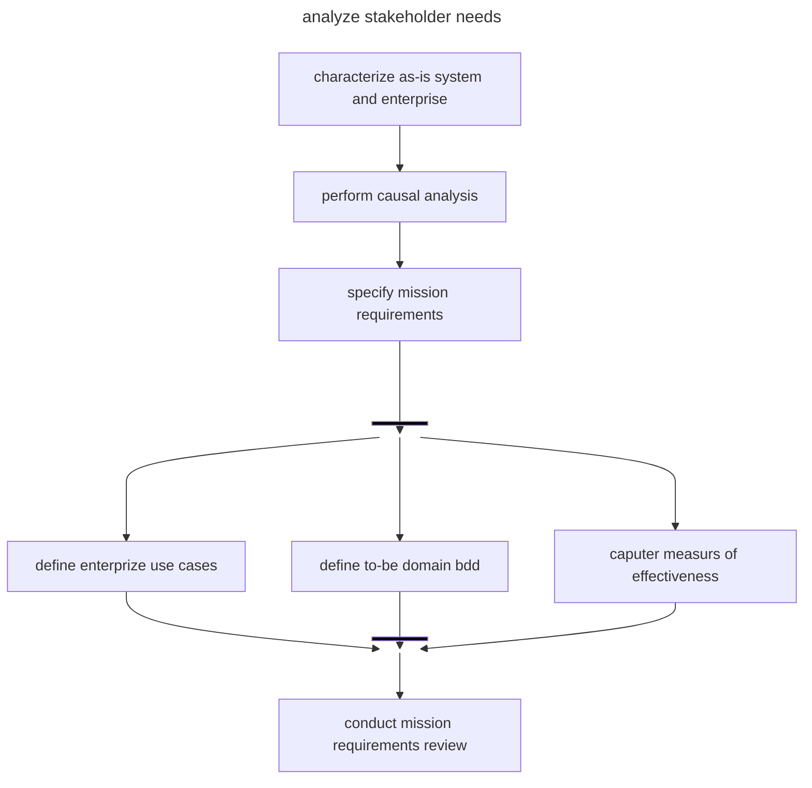

## Analyze Stakeholder needs

```mermaid
---
title: analyze stakeholder needs
---
flowchart TD  
    s1[characterize as-is system and enterprise]
    s2[perform causal analysis]
    s3[specify mission requirements]
    s1 --> s2
    s2 --> s3
    s41[define enterprize use cases]
    s42[define to-be domain bdd]
    s43[caputer measurs of effectiveness]
    sfork:::fork
    sfork[" "]
    s3--->sfork
    sfork ---> s41
    sfork ---> s42
    sfork ---> s43

    sjoin:::fork
    sjoin[" "]
    s41-->sjoin
    s42-->sjoin
    s43-->sjoin

    sjoin --> s5[conduct mission requirements review]

    classDef fork fill:black,height:4px;


```